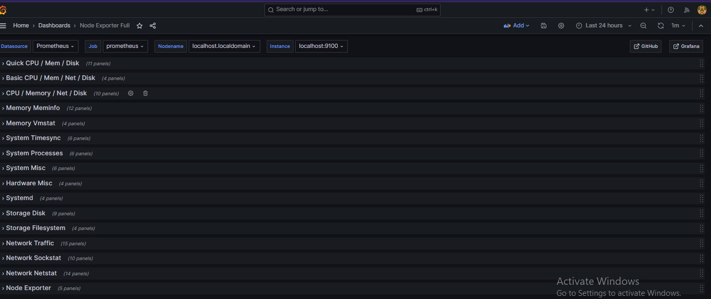
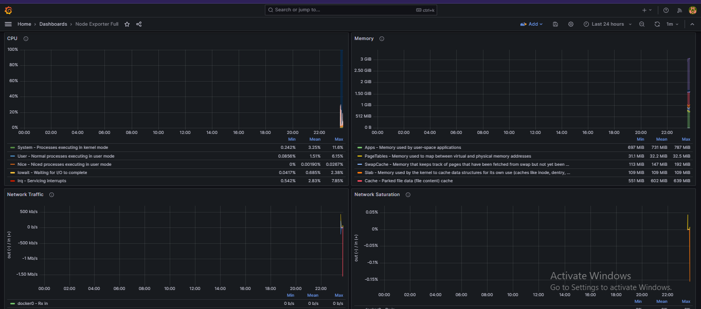
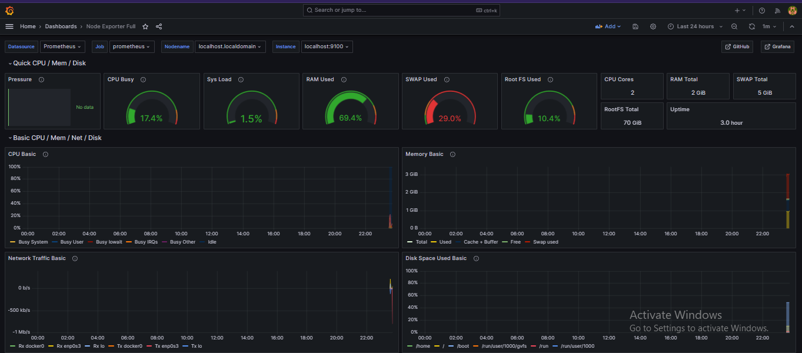
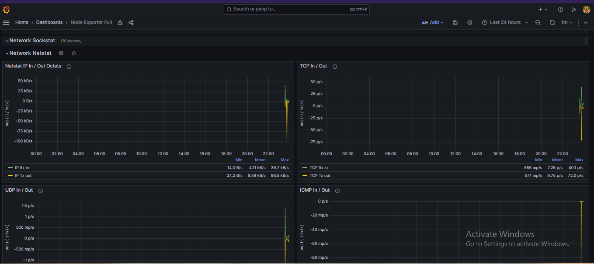

# Server Monitoring Dashboard

## Tools Used
- Prometheus
- Grafana  
- Node Exporter

## What it does
Real-time monitoring of CPU, RAM, Disk and Network
using Prometheus for data collection and Grafana 
for visualization.

## Screenshots
## Screenshots

## How to Run
1. Start Node Exporter on port 9100
2. Start Prometheus on port 9091
3. Start Grafana on port 3000
4. Import dashboard ID: 1860
